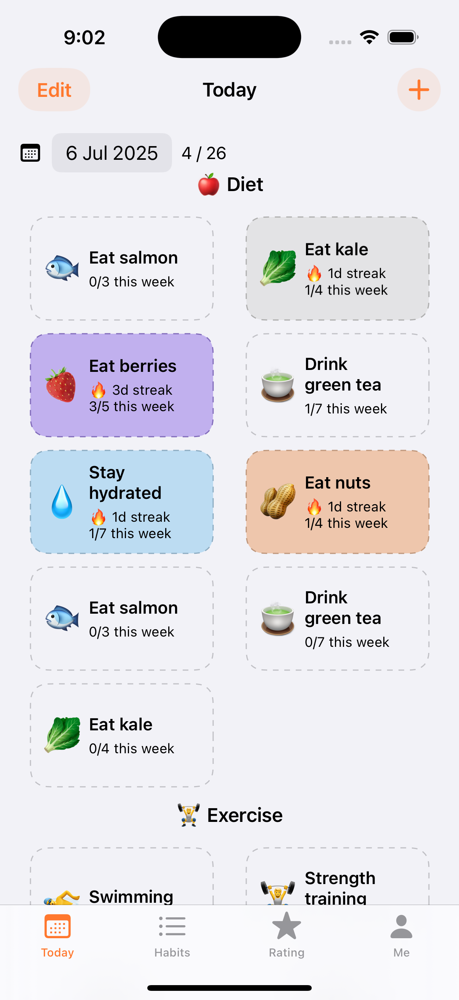
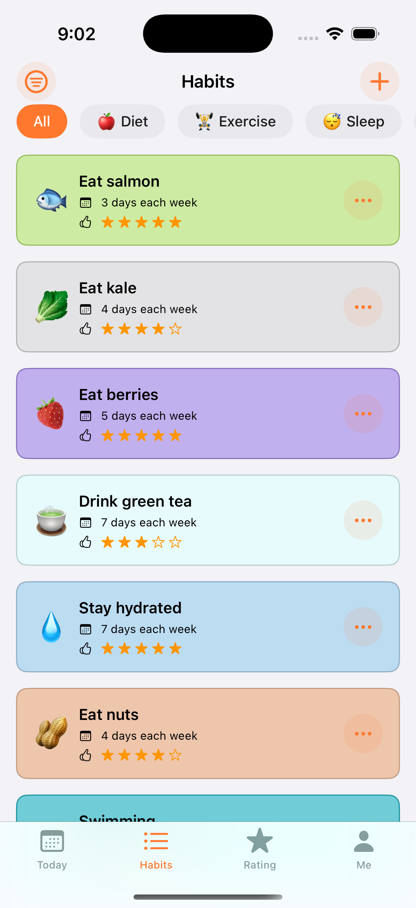
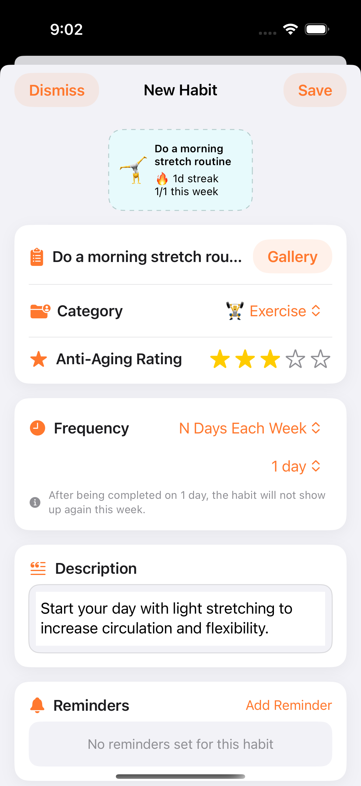
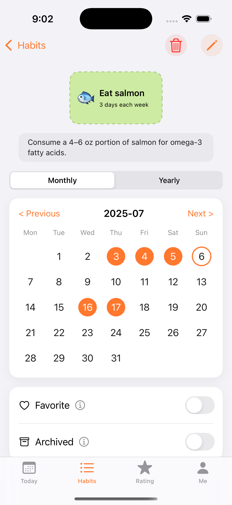

# OM App 🏃‍♂️

[](https://swift.org)
[](https://developer.apple.com/ios/)
[](https://developer.apple.com/xcode/swiftui/)
[](https://creativecommons.org/licenses/by-nc/4.0/)

A modern habit-tracking iOS app built with SwiftUI and GRDB, designed to help users build and maintain habits that promote long-term health and longevity. OM App focuses on evidence-based habits that contribute to healthy aging and overall well-being.

## 🚀 Status
> [!IMPORTANT]
> This application is currently in its **beta stage** and **testing phase**. Public download links are unavailable at this time as we refine the experience.


Build powerful daily habits to extend your lifespan. OM App helps you live longer and feel better with science-based routines for health and wellness.

## 📱 Screenshots

<div align="center">
  
  
  
  

</div>

*The app features a clean, modern interface with habit cards, tracking views, and intuitive navigation designed to help users build lasting health habits.*

## ✨ Features

### 🎯 Core Functionality
- **Habit Tracking**: Create, edit, and track daily habits with customizable frequencies
- **Anti-Aging Rating System**: Each habit includes a 1-5 star rating based on scientific evidence for longevity benefits
- **Smart Categories**: Organized into 5 key areas (Diet, Exercise, Sleep, Preventive Health, Mental Health)

### 🏆 Achievement System
- **24 Achievements**: Streak milestones, check-in goals, perfect weeks/months, category mastery, time-based challenges
- **Progress Tracking**: Visual progress bars and celebration animations
- **Social Sharing**: Share achievements with friends

### 🔔 Smart Reminders
- **Customizable Notifications**: Set personalized reminder times for each habit
- **Habit-Specific Alerts**: Link reminders directly to individual habits
- **Easy Management**: Simple setup and notification preferences

### ⭐ Longevity Rating System
- **12-Level Rating**: From Beginner (F) to Legend (SSS) based on overall health habits
- **Multi-Dimensional Scoring**: Active habits, anti-aging ratings, achievements, check-ins, and streaks
- **Progress Analytics**: Detailed breakdowns and improvement tips

### 🎨 User Experience
- **Modern SwiftUI Interface**: Clean, intuitive design following iOS guidelines
- **Flexible Scheduling**: Support for various frequency patterns (weekly, monthly, custom)
- **Theme Customization**: Multiple color themes and personalization options
- **Haptic Feedback & Sound Effects**: Enhanced user interaction

### 💾 Data Management
- **GRDB Database**: Robust local data storage with SQLite
- **Calendar Integration**: Monthly and yearly habit tracking views
- **Streak Calculation**: Automatic streak tracking with flexible settings
- **Data Export**: Built-in data export capabilities

### 📊 Analytics & Insights
- **Habit Statistics**: Detailed analytics for each habit
- **Progress Visualization**: Calendar views showing completion patterns
- **Category Analysis**: Performance breakdown by habit category
- **Achievement Progress**: Visual progress tracking for all achievements

### 🔧 Advanced Features
- **Habit Archiving**: Archive habits without losing data
- **Icon Customization**: Choose from extensive emoji icon library
- **Multi-language Support**: English and Simplified Chinese localization

## 🏗️ Architecture

### Tech Stack
- **SwiftUI 5.0**: Modern declarative UI framework
- **GRDB**: SQLite database with Swift integration
- **Observation Framework**: Reactive data binding
- **SwiftUINavigation**: Type-safe navigation handling

### Project Structure
```
OMApp/
├── App/
│   └── OMAppApp.swift          # App entry point
├── Components/
│   ├── Common/                           # Reusable UI components
│   │   ├── HabitCardView.swift
│   │   └── HabitItemView.swift
│   ├── Habits/                           # Habit management views
│   │   ├── HabitForm.swift
│   │   ├── HabitIconEdit.swift
│   │   ├── HabitsGallery.swift
│   │   └── HabitsList.swift
│   ├── Me/                               # User profile and settings
│   │   ├── AppItem.swift
│   │   ├── MeFeature.swift
│   │   └── MoreAppsView.swift
│   └── Today/                            # Daily habit tracking
│       ├── TodayView.swift
│       └── TodayViewModel.swift
├── Model/                                # Data models
│   ├── CheckIn.swift
│   ├── Habit.swift
│   └── TodayHabit.swift
├── Service/                              # Business logic and data services
│   ├── HabitIconColorDataSource.swift
│   ├── HabitIconDataSource.swift
│   └── HabitsDataStore.swift
└── Utilities/                            # Helper functions and extensions
    ├── Constants.swift
    ├── Extension/
    │   ├── Color+Extensions.swift
    │   ├── Date+Extension.swift
    │   └── Habit+Extension.swift
    ├── HashableObject.swift
    └── Schema.swift
```

## 🚀 Getting Started

### For Users
The app is currently in **beta testing**. Stay tuned for the official release!


### For Developers

#### Prerequisites
- Xcode 15.0 or later
- iOS 17.0+ deployment target
- macOS 14.0+ (for development)

#### Installation

1. **Clone the repository**
   ```bash
   git clone https://github.com/banghuazhao/wellness-app.git
   cd wellness-app
   ```

2. **Open in Xcode**
   ```bash
   open OMApp.xcodeproj
   ```

3. **Build and Run**
   - Select your target device or simulator
   - Press `Cmd + R` to build and run the app

#### Development Setup

The project uses several key dependencies managed through Swift Package Manager:

- **GRDB**: Database layer
- **SwiftUINavigation**: Navigation handling
- **Observation**: Reactive programming

## 🔧 Configuration

### Database Setup
The app uses GRDB for local data storage. The database is automatically initialized when the app launches.

### Customization
- **Habit Categories**: Easily extend the `HabitCategory` enum to add new categories
- **Frequency Types**: Modify `HabitFrequency` to support different scheduling patterns
- **UI Themes**: Customize colors and styling in the `Constants.swift` file

## 🤝 Contributing

We welcome contributions! Please follow these guidelines:

### Development Process
1. Fork the repository
2. Create a feature branch (`git checkout -b feature/amazing-feature`)
3. Commit your changes (`git commit -m 'Add amazing feature'`)
4. Push to the branch (`git push origin feature/amazing-feature`)
5. Open a Pull Request

### Code Style
- Follow Swift style guidelines
- Use meaningful variable and function names
- Add comments for complex logic
- Ensure all code compiles without warnings

### Testing
- Test on both iPhone and iPad simulators
- Verify functionality across different iOS versions
- Test edge cases and error scenarios

## 📄 License

This project is licensed under the **Creative Commons Attribution-NonCommercial 4.0 International License** ([CC BY-NC 4.0](https://creativecommons.org/licenses/by-nc/4.0/)).

This means you can:
- ✅ Use, share, and modify the code for non-commercial purposes
- ✅ Distribute the code with proper attribution
- ❌ Use the code for commercial purposes without permission

## 🆘 Support

- **Status**: Currently in Beta Stage & Testing Phase
- **Issues**: [GitHub Issues](https://github.com/banghuazhao/wellness-app/issues)
- **Discussions**: [GitHub Discussions](https://github.com/banghuazhao/wellness-app/discussions)
- **Email**: Open an issue for direct contact

## 🗺️ Roadmap

### Long-term Goals
- [ ] AI powered scientific habit recommendations
- [ ] Integration with HealthKit
- [ ] Data export and backup
- [ ] Community features

## 🙏 Acknowledgments

- Built with ❤️ using SwiftUI and modern iOS development practices
- Inspired by scientific research on longevity and healthy aging
- Thanks to the open-source community for amazing tools and libraries

---

**Made with ❤️ by [Banghua Zhao](https://github.com/banghuazhao)**

*Empowering users to build habits that last a lifetime* 🌟
